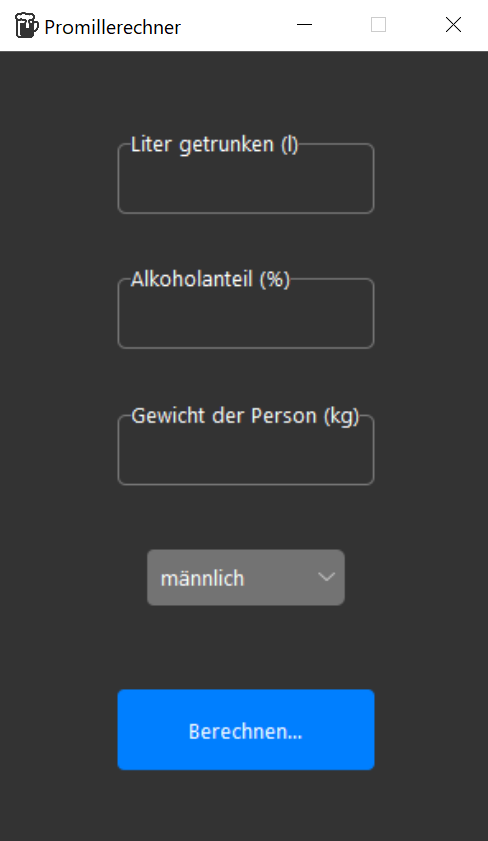

# Promillerechner

GUI und CLI Promillerechner 

Nutzt Python tkinter und einen [tkk skin](https://github.com/rdbende/Azure-ttk-theme). Siehe /src für code

* Datei für grafische Oberfläche: **src\promilleRechnerGUI.py**
* Datei für command line interface: **src\promilleRechner.py**

## Quellen

* icon (https://icon-icons.com/de/symbol/bier/3068)
* tkinter (in Python mitinbegriffen)
* azure ttk theme (https://github.com/rdbende/Azure-ttk-theme)
